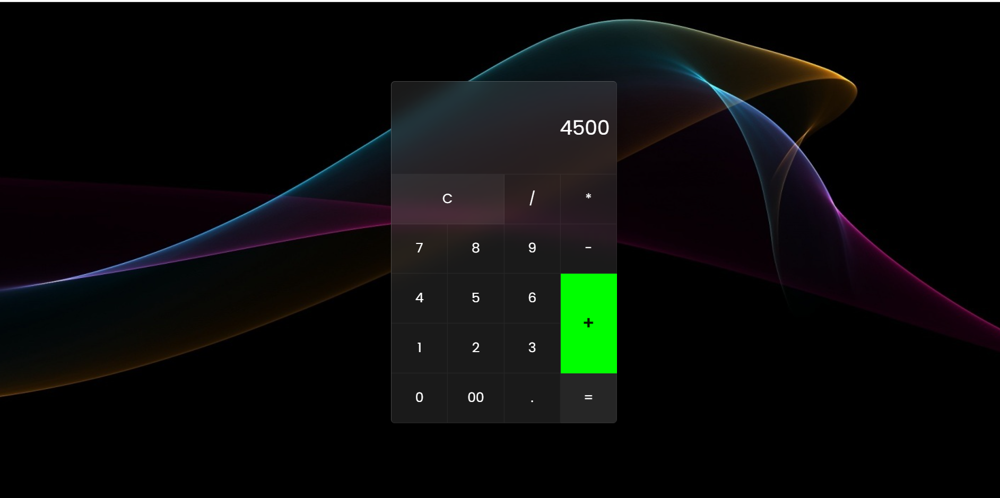

# Simple Calculator(Java_Script) 
 
<h5 align="center">
𝚃𝚑𝚊𝚗𝚔 𝚈𝚘𝚞 𝙵𝚘𝚛 𝚈𝚘𝚞𝚛 𝙲𝚘𝚖𝚒𝚗𝚐 this Repository 😍😍😍 
𝙷𝚊𝚟𝚎 𝚊 nice 𝚍𝚊𝚢 ! 
	
</h5>

## ✔ Description
#### Created a simple calculator from using HTML,CSS and Java Script.

## 🌱 Main Function of Calculator
####  Additions
#### ⚡ Minus
#### ⚡ Divides
#### ⚡ Multiply
#### ⚡ Equals
#### ⚡ All Clear

## 🌱 Basic Background of Calculator

## 🌱 Technology /framework used
* HTML
* CSS
* Java Script

## License
**Copyright @ 2022 Web_Pos_System All Right Reserved By Ishara Maduranga**
